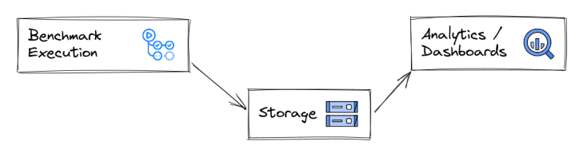
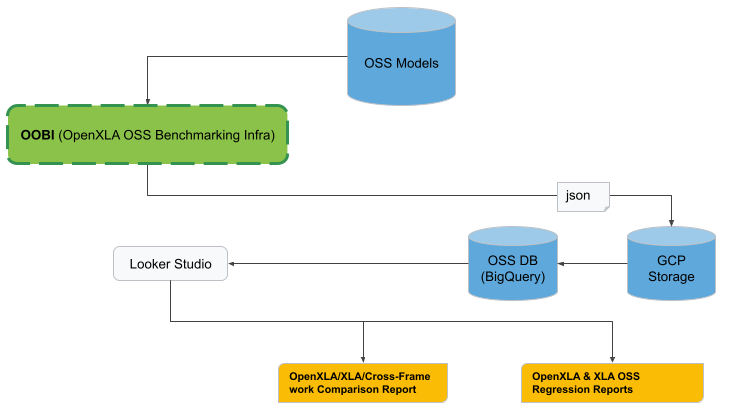

# RFC: OpenXLA Benchmarking Strategy

## Context

This RFC outlines the requirements and strategy to provide benchmarking
infrastructure and metrics dashboards for OpenXLA. It provides a high-level
overview on the components and will be followed up by more detailed technical
design RFCs.

Disclaimer: This work is currently sponsored by Google, and initial priorities
will thus reflect Google's priorities. Throughout this document, "we" refers to
the current working group at Google dedicated to this project.

### Summary

1. For all compilers/repositories under the OpenXLA umbrella - with an initial
   focus on, but not limited to _XLA:GPU, XLA:CPU, IREE:CUDA and IREE:CPU_ (x86
   llvm-cpu backend) - we want to provide an **infrastructure** to run automated
   benchmarks regularly. OpenXLA engineers must be able to re-run and reproduce
   the results of a benchmark in the exact environment.
1. We want to provide **interactive** **dashboards** accessible to the community
   to evaluate _Progression_ and _Competition_, including comparisons with
   frameworks and compilers outside of the OpenXLA umbrella. We also provide
   _Regression_ dashboards for _IREE_ on a common infra stack. Regression
   dashboards for _XLA:CPU and XLA:GPU_ are not the primary focus as of now and
   may be considered in the future.
1. We focus on **high-level metrics** such as wall-time and max memory
   consumption that can be obtained without instrumentation. In some cases, e.g.
   for training, this includes framework overhead, and it is up to the benchmark
   selection and detailed dashboard design to ensure comparability. The
   infrastructure design must be flexible enough to support instrumented metrics
   and microbenchmarks, but we defer the detailed requirements and design.

Initial focus will be on Progression and Competition for XLA:CPU/GPU and
IREE:CPU/CUDA to analyze E2E latency and memory. It will show comparisons over
time on an initial set of agreed-upon models (as listed under “Detailed
Requirements”), which will also define the frameworks to support. Dashboards
will update automatically at least once a week, ideally nightly, using the
latest head or nightly release (whereas third-party compilers and frameworks may
need to rely on official releases, depending on availability and release
strategy).

Initial focus requirements are listed as **P0** below. **P1** requirements will
be implemented in the next stages, but will be considered during the design.
**P2** will need further discussion.

## Use Cases

### Target Audience

Target audience (“user personas”) of the benchmarking infrastructure and
dashboards, in order of importance:

1. **Compiler Engineers**. OpenXLA contributors that contribute to the OpenXLA
   codebase via PRs in GitHub.
1. **Potential Adopters**. Partners not yet using or contributing to OpenXLA,
   but we would want them to do so - e.g. vendors of not-yet supported
   accelerators.

### List of Use Cases

We foresee the following use cases for benchmarking efforts:

As a **Compiler Engineer** I want to…

- **\[P0\]** see the evolution of high-level performance metrics such as latency
  and memory consumption for XLA:CPU/GPU and IREE:CPU/CUDA over time
  (“Progression”). This allows me to judge the impact of my efforts, and make
  informed decisions about future engineering choices.
- **\[P0\]** see comparisons of aforementioned metrics for a variety of
  compilers and frameworks including 3P over time (“Competition”). This way, I
  can compare the performance of XLA:CPU/GPU, IREE:CPU/CUDA and various
  state-of-the-art competitors to evaluate competitiveness and success metrics
  for our compilers, and judge where to invest my efforts to make progress
  towards target metrics.
- **\[P0\]** be able to reproduce the results of all benchmarks locally to work
  on improving performance. This includes easy reproducibility of the
  environment, ideally by means as simple as selecting an appropriate VM on a
  cloud service, or at least having all steps to set up a run on a custom device
  (such as a mobile device) clearly documented. We must ensure benchmarks are
  run on a stack that is available to the community, and all artifacts and
  commands required for execution are accessible. All artifacts generated during
  the benchmarking runs also need to be available for download.
- **\[P1\]** see aforementioned benchmark results over a wide variety of models
  so I can analyze how different types of models perform. This will maximize the
  meaningfulness of the gathered results, and expose each compiler’s strengths
  and weaknesses.
- **\[P1\]** see progression and competition results over a wide variety of
  hardware (server and mobile) so I can compare and optimize for multiple
  configurations.
- **\[P1\]** be able to adjust the progression and competition dashboards to my
  need to filter across various dimensions (compilers, models, hardware,
  configurations, …) so I can focus on the data relevant for my use-case.
- **\[P1\]** have analytics support in finding performance regressions
  (“Regression”) for XLA:CPU/GPU and IREE, and be guided towards the single
  change that introduced a regression so I can fix it or roll it back.
  Regressions should be detected on a variety of hardware, models and
  configurations, but I will want a high-level summary of the results and not be
  presented with all combinations at all times.
- **\[P1\]** run a set of benchmarks on demand on a pending change to judge the
  performance impact before merging into main.
- **\[P1\]** be able to add new, selected benchmarks for comparison, post- and
  pre-submit regression to cover a set of greater variety and include specific
  models which are important to my use-case. These models will then be made part
  of the automated runs, with their results available through to the community.

As a **potential adopter**, I want to…

- **\[P0\]** compare the existing compiler stacks to other compilers and across
  different framework/compiler combinations so I can judge where to invest my
  efforts.

## Detailed Requirements

We can break the use cases into three different areas:

1. **Comparison**: High-level overview of performance over time. This includes
   both Progression and Competition (“Compiler over time” and “Compiler vs
   others over time”).
1. **Regression**: Detailed view of evolution of the same compiler over time.
   Provides support in finding culprit PRs and regression monitoring after
   changes have been merged to main.
1. **Presubmit regression**: Ability to run a subset of the regression
   benchmarking suite on a PR to identify potential performance implications,
   and make informed decisions about merging the PR during review.

### Types of Benchmarks and Metrics

We want to collect and visualize metrics for:

- **\[P0\]** Inference
- **\[P1\]** Training
- **\[P1\]** Compilation
- **\[P2\]** Microbenchmarks

We will focus on high-level “black box” metrics that do not require compiler
instrumentation and can thus be collected for third-party compilers as well.

The design will support "compiler-level benchmarks" that take as input
StableHLO, and "framework-level benchmarks", which take as input programs
supported by that framework. The latter will then also be able to expose
performance issues that arise in the interaction of and integration layers of
framework / bridge / plug-in / compilers. We aim at good coverage around both in
the long run, but we must ensure comparability in benchmark selection (e.g. we
should not compare framework- and compiler-level benchmarks directly).

| Metric | Type of Benchmark |
|-------------------------------------------|---------------------------------------------------|
| Total (wall) time | Inference, Training, Compilation, Microbenchmarks | | Peak
memory host / device | Inference, Training, Compilation, Microbenchmarks | |
Inference latency and throughput | Inference | | Training throughput (e.g.
examples / sec) | Training |

It is expected that the benchmarks themselves will take care of establishing
comparability for metrics. It is up to the metric definition to specify e.g.
units, and no conversion will be provided by the infrastructure. Training
benchmarks will be framework-level, whereas inference benchmarks can be either
framework- or compiler-level.

It is currently not in scope to explicitly measure framework overhead, but this
could be added later if we include the same benchmarks with and without
framework.

Running microbenchmarks has to be supported by the infrastructure, but we expect
additional requirements on the dashboards (e.g. grouping of hundreds of small
benchmarks) which are out of scope for now.

### Comparison

Comparison benchmarks need to run regularly, e.g. daily or weekly. Relevant
compilers and frameworks to compare:

- **\[P0\]** IREE:CUDA
- **\[P0\]** IREE:CPU
- **\[P0\]** XLA:GPU
- **\[P0\]** XLA:CPU
- **\[P0\]** PT/TorchInductor
- **\[P1\]** nvFuser
- **\[P2\]** TVM
- **\[P2\]** PT/XLA on Cloud TPU

For a given model or workload, the framework used to compare compilers will
depend on whether an implementation is available in that framework. We aim for
coverage across **Tensorflow, PyTorch and JAX**.

### Nightly / Post-Submit Regression

Regression Dashboards will only be offered for Compilers developed under the
OpenXLA umbrella:

- **\[P1\]** IREE:CUDA
- **\[P1\]** IREE:CPU
- **\[P1\]** IREE:Vulkan
- **\[P2\]** XLA:GPU
- **\[P2\]** XLA:CPU

Regression benchmarks need to be able to run for each commit to support culprit
finding. Whether they actually run on each commit or find the point of
regression by bisecting after a regression has been detected is up to the
detailed design. Regression benchmarks will focus on IREE first, and exact scope
of XLA regression requirements is still TBD.

### Pre-submit regression

Presubmit regression testing will only be offered for Compilers developed under
the OpenXLA umbrella. We already have presubmits running for both compilers and
aim towards unifying these.

- **\[P0\]** XLA-GPU
- **\[P1\]** XLA-CPU
- **\[P1\]** IREE-GPU
- **\[P1\]** IREE-CPU

For presubmit regression testing, a smaller subset of models will be selected to
keep the runtime minimal, and it will only focus on inference times from HLO
input. These tests need to be explicitly triggered from a PR author or reviewer,
and it is up to either of them to evaluate and act upon the results. We will not
block merging based on a presubmit regression result, as a performance
regression for some benchmarks may be acceptable if others are significantly
improved.

### Hardware

Below is the initial hardware focus set based on GCP availability. We will
create and maintain the required images, and provide the needed combinations of
software versions (e.g. supported versions of OS Kernel, drivers, and
CUDA-libraries).

- CPU X86_64
  - Intel Skylake (AVX-512)
  - Intel Broadwell (AVX-2)
  - Intel Cascade Lake (AVX-512 + VNNI)
  - AMD Rome/Milan (AVX-2)
  - AMD Genoa (AVX-512 + VNNI + BF16 support) **- when available**
  - Intel Sapphire Rapids (AVX-512 + VNNI with BF16/FP16 support + AMX) **- when
    available**
- NVIDIA GPU (single-GPU setups), Enterprise Tesla series
  - V100, Volta GV100
  - A100, Ampere GA100
  - H100, Hopper GH100 **- when available**

All tooling will be available through the OpenXLA repository, enabling partners
to run the benchmarks on their own hardware, e.g. on-premise or through
self-hosted GitHub Action runners.

While we initially focus on GCP, we ultimately want to enable non-GCP hardware
as well and will design the infrastructure in a way that makes this possible.
More details on this will follow in separate RFCs. Once the core components are
in place, we hope to collaborate across OpenXLA partners to extend the list of
supported hardware. Following the input to this RFC, we are specifically looking
at AMD GPUs and aarch64 hardware as possible extensions - the latter is
available on GCP.

### Models

We have selected the models below as our initial focus set. We expect this list
to grow over time. Specifically more SoTA LLMs such as LLaMA have been brought
up as candidates - we aim at enabling project contributors to add additional
models with little effort as soon as possible.

The goal, however, is not to collect a large amount of benchmarks and replace
repositories such as MLPerf or TF ModelGarden, but rather to stick with a fairly
small, curated and representative list of models.

| Name | Param Count | Format | Data Types | BM Type | Targets |
|--------------------|-------------|--------------|------------|---------------------|-----------|
| FermiNet/Psiformer | O(1M) | JAX | f32 | Training | CUDA | | AlphaFold 2 |
O(1B) | JAX | fp16, fp32 | Inference | CUDA | | ResNet-50 | 29M | TF, PyTorch |
fp16, fp32 | Inference | CUDA, x86 | | BERT-Large | 330M | TF, PyTorch | fp16,
fp32 | Training, Inference | CUDA, x86 | | T5-Large | 770M | TF, PyTorch | fp16,
fp32 | Inference | CUDA, x86 | | GPT-3 | 175B | JAX, PyTorch | fp16, fp32 |
Training | CUDA | | DLRM | 25B | PyTorch | fp16, fp32 | Inference | CUDA, x86 |

## Design Overview

The design seeks to ensure equal footing of contributors from different
organizations and full reproducibility of the benchmark results. The
infrastructure will be built on publicly available infrastructure: GCP and
GitHub Actions. This way, we avoid divergence (hardware as well as software,
drivers, libraries, …) between environments used by different organizations and
ease of sharing these setups (e.g. by preconfigured docker containers and GCP
instances).

Importantly, we will not tie the execution of benchmark to GCP and GitHub
Actions. It will be possible to run benchmarks locally, with the results and all
intermediate artifacts dumped to local storage instead of cloud storage. All GCP
functionality will be built as optional layers around the execution tooling.

This section sketches the high-level design. A more detailed design will be
submitted in separate RFCs.

### Current State

IREE is currently running comparison benchmarks based on
[SHARK Tank](https://github.com/nod-ai/SHARK), pre- and post-submit regression
benchmarks based on our own tooling. XLA has a first set of A/B regression
benchmarks implemented.

This approach has multiple drawbacks, including:

- Dashboards have limitations in terms of flexibility, storage and display of
  historical data. Most notably, data is only stored as JSON and displayed in
  static dashboards.
- We’re running separate infrastructures for comparison and regression, and both
  are tailored towards IREE, which makes inclusion of XLA non-trivial.

We will build new benchmarking infra and tooling by re-using and extending the
existing IREE system, providing a unified infrastructure and shareable for all
compilers and use-cases, and replace SHARK Tank.

### Planned State

To allow us to move forward quickly, and replace existing infrastructure step by
step, we aim at clearly separating benchmark execution, storage and analytics
with minimal, clearly defined boundaries between them.

The new infrastructure components, named **OOBI** **(OpenXLA OSS Benchmarking
Infrastructure)**, will be part of the OpenXLA repositories, along with the
models selected as a benchmarking set. We will rely on GitHub Actions and GCP
Runners to run benchmarks. Results are stored in JSON files in a public GCS
bucket with additional artifacts alongside. A Cloud Function will then import
the JSON file contents into BigQuery for analytics, and we will use
[Looker Studio](https://cloud.google.com/looker-studio) - GCP’s reporting and
dashboarding solution - for visualization. This approach enables us to create
powerful dashboards from multiple sources with potentially different JSON
formats, while also empowering the community to run their own analytics solution
on the raw data.

### Next Steps

The detailed technical designs are currently fleshed out, and we will present
them in subsequent RFCs in the next weeks.
