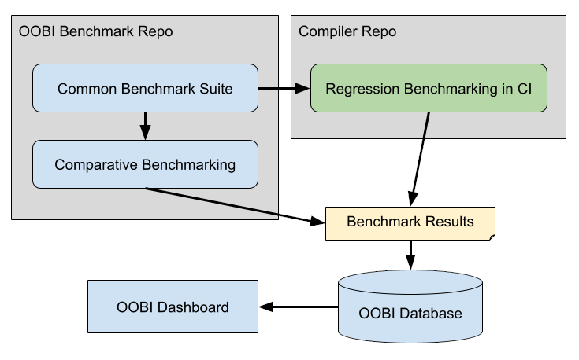

# RFC: OpenXLA OSS Common Benchmark Suite

## Objective

*   Create a **benchmark suite** to compare the performance of OpenXLA compilers
    and third-party compilers.
*   Create a new repository **“openxla-benchmark”** under OpenXLA organization
    to host the benchmark suite along with the related tools and the benchmark
    workflow.
*   The benchmark suite is **reusable** for regression benchmarking in the
    OpenXLA compiler projects.

## Context

This is a subsequent RFC of
[OpenXLA Benchmarking Strategy](https://github.com/openxla/community/pull/75)
outlines a benchmark suite for comparative and regression benchmarking for the
OpenXLA and third-party compilers that the OpenXLA community is interested in.
It is part of the **OOBI** (OpenXLA OSS Benchmarking Infrastructure).

## Motivation

The OpenXLA community wants to regularly (e.g. daily, weekly) compare and track
the performance of OpenXLA and third-party compilers for assisting compiler
development. Therefore, it needs a benchmark suite that includes the models and
devices the OpenXLA community has prioritized and adjusted accordingly based on
the shifts in focus.

In addition to the comparative benchmarking, multiple compiler projects under
OpenXLA (e.g. IREE, XLA, and openxla-nvgpu) want to run the same benchmark suite
as regression benchmarks to track the performance on the focused targets and
potentially test with experimental flags. So the benchmark suite should be
reusable and customizable in their projects.

## Use Cases

*   Running in a comparative benchmark workflow regularly (e.g. daily, weekly,
    every release) to generate reports and show relative performance between
    OpenXLA and third-party compilers.
*   Being integrated into the compiler projects to run on presubmit and
    postsubmit for the regression benchmarking.

## Design Overview

This RFC proposes to create a common benchmark suite that is
**compiler-agnostic** and can be used in standalone comparative benchmark
workflows and regression benchmarking resident in each compiler project.

The common benchmark suite only includes the high-level definitions, such as the
models and target devices. It allows compiler projects to import and extend the
definitions to include details of how to compile the models and run on the
devices. This makes it easier to build regression benchmarks within each
compiler project while reducing boilerplate code by reusing the models and
benchmark definitions. Compiler projects are also free to run benchmarks with
different experimental configurations. All compiler-specific extensions are
implemented and maintained in each compiler project.

The common benchmark suite will also be used in a comparative benchmark workflow
to run multiple OpenXLA and third-party compilers to gather the comparative
results. It will run the common benchmark suite with each compiler and collect
the comparable results.

The current
[IREE benchmark framework](https://github.com/openxla/iree/tree/main/build_tools/python/e2e_test_framework)
already supports decoupling into compiler-agnostic and compiler-specific parts.
The plan is to extract the code from the
[IREE repository](https://github.com/openxla/iree) and reuse them in the new
common benchmark suite.

The figure below shows the relationship between components. This RFC covers the
contents of "OpenXLA Benchmark Repository" and the integration into compiler
repositories. See
[OpenXLA Benchmarking Strategy](https://github.com/openxla/community/pull/75)
for how OOBI stores benchmark results in the database and visualizes in the
dashboard.



## Detailed Design

### Common Benchmark Suite

The common benchmark suite consists of:

*   A framework written in Python to define benchmarks
*   The collections of commonly-benchmarked models
*   The collections of benchmark definitions.

#### Framework to Define Benchmarks in Python

The framework contains the classes and utilities to define benchmarks. The
classes only describe the compiler-agnostic parts of a benchmark, which include:

*   Model class to define model metadata and the artifacts.
    *   Model artifacts will be provided in the original format (the
        implementation with ML framework) and its derived formats (e.g, exported
        StableHLO).
*   Test data class to define input and expected output data.
    *   Expected output are provided with tolerance settings for verification.
*   Device class to define device specifications to run benchmarks (e.g., GCP VM
    types, host environment, specification of the accelerator).
*   Benchmark class to define a tuple of the model, input data, expected output,
    and target device specification to run.

As model implementations will be available in their respective frameworks (e.g.,
JAX, PyTorch, Tensorflow). Framework-level benchmarks can import these
implementations through Python modules. Utilities to compare the model output
with the expected results will also be provided in the benchmark suite.

The common benchmark suite intentionally only includes a few exported model
formats that are widely used as compiler input and stable. The initial set
includes:

*   StableHLO
*   Tensorflow v1/v2 saved model
*   TFLite flatbuffer

For other exported model formats (e.g. Linalg MLIR from
[torch-mlir](https://github.com/llvm/torch-mlir/tree/main)), compiler projects
should import them from the source model implementation and cache by themselves.

#### Collections of Benchmark Definitions

Several collections of benchmarks will also be defined in the common benchmark
suite, initially for the comparative benchmarking. The benchmark collections are
subject to growth overtime. An initial suite has been defined in the **Models**
section of
[OpenXLA Benchmarking Strategy](https://github.com/openxla/community/pull/75).

#### Example of Common Benchmark Definitions and Using with Compilers

The details of definitions are still subject to change, but here are the
examples to help explain the design.

In the common benchmark suite, the inference benchmarks are defined as:

```py
### In module `benchmark_framework`
class ModelFormat(Enum):
  """Supported framework/stable model formats."""
  # Framework model formats.
  TENSORFLOW_V1 = "tensorflow_v1"
  TENSORFLOW_V2 = "tensorflow_v2"
  PYTORCH = "pytorch"
  JAX = "jax"
  # Exported model formats.
  TENSORFLOW_V1_SAVED_MODEL = "tensorflow_v1_saved_model"
  TENSORFLOW_V2_SAVED_MODEL = "tensorflow_v2_saved_model"
  TFLITE_FLATBUFFER = "tflite_flatbuffer"
  STABLEHLO = "stablehlo"

class DataFormat(Enum):
  """Types of input/output data format."""
  # Frameworks can use different data layouts (e.g. NCHW, NHWC). So this
  # provides information of what input/output data format a model uses.
  # For a derived model, they usually use the same layout as its source
  # framework model. Special data layout can be added if there is an exception.
  TENSORFLOW_NUMPY = "tensorflow_numpy"
  PYTORCH_NUMPY = "pytorch_numpy"
  JAX_NUMPY = "jax_numpy"

class ModelDerivation :
  model_format: ModelFormat
  # - For the exported model, it's the versioned URL to fetch the model.
  # - For the model implementation with framework, it's the Python module path
  #   to import the model module with `importlib.import_module`. This prevents
  #   pulling in unnecessary dependencies from those modules.
  aritfact: str
  # Input format, usually same as its soruce model implementation.
  input_format: DataFormat
  # Output format, usually same as its soruce model implementation.
  output_format: DataFormat

class Model:
  """Model to benchmark with variety of formats derived from the same source."""
  name: str
  # Source model format.
  source_format: ModelFormat
  # Information of the source model.
  source_info: str
  # Model derivations in different formats, including the source framework
  # implementation and its exported models.
  # A single model may have multiple derivations for various ways it can be
  # captured as input to a runtime. For instance, it could be an MLIR bytecode
  # file of the StableHLO dialect, a TFLite flatbuffer, a Tensorflow saved
  # model, or the original JAX source file.
  derivations: Dict[ModelFormat, ModelDerivation]

class Verifier:
  """Verifier type with its parameters to verify model output."""
  verifier_type: VerifierType
  parameters: Dict[str, Any]

class ModelTestData:
  """Input or expected output in variety of formats from the same source."""
  name: str
  # Information of the data source.
  source_info: str
  # Stable (Versioned) URLs to download test data for each format.
  artifacts: Dict[DataFormat, str]
  # Verifier with parameters (e.g. tolerance) for the expected output.
  verifier: Optional[Verifier]

class DeviceSpec:
  """Device specification to run benchmarks."""
  name: str
  # Describes the host that runs the runtime and talks to the accelerator.
  # E.g., GCP
  host_type: str
  # E.g., c2-standard-16
  host_model: str
  # E.g., linux-x86_64
  host_environment: str

  # Describes the target accelerator (can be same as the host for CPU benchmarks).
  # E.g., cpu, gpu, my-custom-accelerator
  accelerator_type: str
  # E.g., nvidia-a100-40g
  accelerator_model: str
  # E.g., intel-cascadelake, nvidia-ampere
  accelerator_architecture: str
  # E.g., "num_of_gpus": 4, "cpu_mask": "0-3"
  accelerator_attributes: Dict[str, Any]

class InferenceBenchmark:
  """Common inference benchmark."""
  # Unique id to identify the benchmark.
  benchmark_id: str
  model: Model
  input_data: ModelTestData
  expected_output: ModelTestData
  target_device_spec: DeviceSpec

### In module `bert_benchmark`
BERT_LARGE = Model(name="bert-large", ...)
GPU_100_DEVICE_SPEC = DeviceSpec(name="gcp-a2-highgpu-1g", ...)

BERT_ON_A100 = InferenceBenchmark(
  model=BERT_LARGE,
  target_device_spec=GPU_100_DEVICE_SPEC,
  ...
)

### In module `data_verifier`
def verify(verifier, model_output, expected_output_path) -> bool:
  if verifier.verifier_type == VerifierType.NumPyGoldenValue:
    return verify_numpy_golden_value(model_output, expected_output_path,
      verifier.parameters)
  ...
```

Here is a simple example of how the common benchmark suite can be used to run
XLA:GPU compiler-level benchmarks with `bert_benchmark.BERT_ON_A100`.

```py
from openxla_benchmark import bert_benchmark, data_verifier

RUN_HLO_MODULE_BINARY_PATH="/bazel-bin/tensorflow/run_hlo_module"

def benchmark_xla_gpu(common_benchmark):
  source_model = common_benchmark.model.derivations[
    common_benchmark.model.source_format
  ]
  dump_hlo_path = dump_xla_hlo(source_model)

  input_remote_path = common_benchmark.input.artifacts[
    source_model.input_format
  ]
  input_path = download_file(input_remote_path)
  # Convert the source model input to numpy array. This might do nothing if the
  # source model is already using a compatible numpy format.
  numpy_input_path = convert_to_numpy_tensor(
    source_model.input_format, input_path)

  cmd = [
    RUN_HLO_MODULE_BINARY_PATH,
    "--input_format=hlo",
    "--platform=gpu",
    f"--input_module={dump_hlo_path}",
    f"--input_data=@{numpy_input_path}"
  ]
  output = subprocess.run(cmd, ...)

  # Parse output into numpy array (details omitted).
  numpy_output = parse_output(output)
  # Convert the ouptut numpy array to source model output.
  model_output = convert_from_numpy_tensor(
    source_model.output_format, numpy_output)

  expected_output_remote_path = common_benchmark.expected_output.artifacts[
    source_model.output_format
  ]
  expected_output_path = download_file(expected_output_remote_path)
  verify_verdict = data_verifier.verify(
    verifier=common_benchmark.expected_output.verifier,
    model_output=model_output,
    expected_output_path=expected_output_path)

  return verify_verdict, metrics
```

Here is another example with IREE. It extends the common benchmark suite with
IREE's own configurations and flags. The existing IREE benchmark framework can
then compile and run benchmarks following the detailed configurations. Some
implementation details are ommited.

```py
from openxla_benchmark import benchmark_framework, bert_benchmark

class IreeModuleGenerationConfig:
  """Describes how to compile a model with IREE."""
  model: benchmark_framework.Model
  target_architecture: str
  # IREE compiler backend.
  target_backend: str
  extra_compile_flags: List[str] = []

class IreeInferenceBenchmark:
  """Describes an IREE inference benchmark."""
  # Reference to the base benchmark.
  base_benchmark: benchmark_framework.InferenceBenchmark
  module_generation_config: IreeModuleGenerationConfig
  # IREE runtime driver.
  runtime_driver: str
  extra_runtime_flags: List[str] = []

def get_module_generation_config(model, device_spec) -> IreeModuleGenerationConfig:
  """Build the compilation config for the model and target device spec."""
  ...

def get_runtime_driver(device_spec) -> str:
  """Select the runtime driver based on the target device spec."""
  ...

def derive_iree_benchmark(common_benchmark) -> IreeInferenceBenchmark:
  """Derive IREE benchmark from the common benchmark."""
  # Fill out IREE compile and run configurations according to the model
  # and target device spec of the `common_benchmark`.
  gen_config = get_module_generation_config(
    model=common_benchmark.model,
    device_spec=common_benchmark.target_device_spec)
  runtime_driver = get_runtime_driver(
    device_spec=common_benchmark.target_device_spec)
  return IreeInferenceBenchmark(
    base_benchmark=common_benchmark,
    module_generation_config=gen_config,
    runtime_driver=runtime_driver)

IREE_BERT_ON_A100 = derive_iree_benchmark(bert_benchmark.BERT_ON_A100)
# IREE_BERT_ON_A100 can now be passed to the existing IREE benchmark
# framework to compile and run.
```

It’s worth noting that except for the special cases, compilers in general are
expected to derive their compiler-specific configurations automatically from the
common definitions based on the models and target device specifications.

### Integration in Compiler Project

For the compiler projects that want to import and extend the common benchmark
suite in their repositories, they only need to checkout the repository of the
common benchmark suite as a submodule, add it to the Python module search path,
and install the dependencies. The release can be set up if needed.

The dependencies of the common benchmark suite should be minimized and not more
than lightweight libraries such as
[requests](https://requests.readthedocs.io/en/latest/). For benchmarks involving
ML frameworks, the extra `requirements.txt` will be stored with the benchmark
definitions and pin the package versions. It is not necessary to install it if
you do not run those benchmarks.

The class definitions of the common benchmark suite should be stable with rare
breaking changes once they are mature. It is important to not introduce extra
overhead for compiler projects to update their integrated common benchmark
suite.

## Next Step

### Near-term Plan

The near-term plan is to enable regular comparative benchmarking and enable all
OpenXLA compiler projects to start reusing the common benchmark suite to build
their regression benchmarking.

The repository “openxla-benchmark” will be created to host the common benchmark
suite. After that, IREE team will start moving their Python-based IREE benchmark
framework there and refactor it to become the common benchmark suite.

The comparative benchmark workflow currently hosted in the IREE repository will
also be split out, refactored to use the common benchmark suite, and additional
compilers (e.g. XLA compiler) will be added.

To simplify the repository structure, the comparative benchmark workflow will
live under the same new repository with the common benchmark suite. A proper
directory structure should prevent the common benchmark suite from being
polluted by the comparative benchmark workflow. For example:

```
openxla-benchmark repository
├─ common_benchmark_suite
└─ comparative_benchmark
```

This will give a simple start and it won't be hard to spin out the comparative
benchmark workflow into a separate repository if needed.

### Long-term Plan

At the beginning, the comparative benchmark workflow will implement and maintain
the code to run the common benchmark suite with multiple compilers. It is
actually a costly integration process to bump the versions and fix any issues to
run benchmarks with multiple compilers, especially when some compilers require
special flags to run some models.

To mitigate this problem, there is a plan to define a standard benchmark
interface for compiler projects to implement in their tools. And the comparative
benchmark workflow can run the tools without compiler-specific knowledge of how
to build and run the models.

The details still need to be finalized and will be a separate RFC.

## Alternatives Considered

The IREE team evaluated two existing solutions:
[SHARK](https://github.com/nod-ai/SHARK/tree/main) and
[MLPerf](https://github.com/mlcommons/inference). Both of them focus on
comparative benchmarking with multiple compilers and frameworks.

SHARK highly integrates IREE and other compilers so it is not easy to reuse in
the regression benchmarks without pulling in unnecessary dependencies. MLPerf
doesn’t provide a common way to define models. And it is ad-hoc to run different
types of models, which makes it hard to add new benchmarks.
