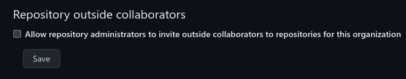

# GitHub Organization Management

As we are spinning up the governance of the OpenXLA project, we are still in a
state where a number of things are managed by Google. In particular, the OpenXLA
GitHub organization is a Google-affiliated organization under Google's GitHub
Enterprise account. While we want to make the project as open as possible, this
state does create a few constraints on how things are run that require adherence
to Google policies. First, we want to acknowledge that this is sub-optimal and
assure you that it is not the goal state. 🙂 Fortunately, all these policies are
at least
[documented publicly](https://opensource.google/documentation/reference).

We are also aiming to make
[governance](https://github.com/openxla/community/blob/main/governance/GOVERNANCE.md)
of the OpenXLA project based on individuals and their contributions to the
project, not based on the organizations with whom they are affiliated. At the
same time, we recognize that companies are making significant investments in the
project and that work on OpenXLA is frequently coordinated within teams at a
given company (note I use "company" throughout this RFC rather than
"organization" to avoid ambiguity with GitHub organizations).

We'd like to set up the GitHub organization in a way that balances these
concerns and makes permissions management as seamless as possible. Ideally,
administration of the GitHub organization will be transparent and we can get it
out of the way of working on the core aspects of the project.

## Basic Model

The OpenXLA project delegates administration of the OpenXLA GitHub organization
to Google. This comes with GitHub Enterprise features including self-hosted
GitHub Actions runners and large GitHub-managed runners. It also imposes the
constraint, however, that the organization must conform to Google's policies for
its GitHub organizations. This delegation can be revisited at any time by the
Core Maintainers.

Google will appoint a few OpenXLA members who are also Google employees to
manage the administration of the GitHub organization. These Googlers will be the
contact point for questions about the GitHub organization and they will be
responsible for maintaining compliance with relevant policies. For visibility,
they will be added to an OpenXLA GitHub team, `github-owners`. They will also
seek clarification of, alteration to, or exemption from Google's policies
surrounding GitHub organizations when they create a hindrance for the project,
though none of these can be guaranteed.

## Adding Organization Members

GitHub's auth model is such that it is extremely difficult to meaningfully
develop a GitHub project without being a collaborator on that project. In
particular, being a collaborator is required to be tagged, to be added as
reviewer, to add reviewers, to add labels, to run presubmits, etc. Forking and
sending a PR is fine for one-off or occasional contribution, but for day-to-day
development you really need some level of explicit access. Read-only access will
enable some of these, but "triage" access is needed for some of them and is
generally a reasonable level for most people.

However, organization membership does grant some access that would be
problematic if abused, such as the ability to run CI (which is effectively
remote code execution as a service). We therefore do want to maintain *some*
controls on who has access. Additionally, we want to maintain visibility and
auditability of that that access. Managing collaborators at the level of an
individual repository can make it quite difficult to keep track of. We would
like to have it administered in such a way that access can be tracked and
managed at the organization level instead.

Google's policies on GitHub organizations include that
[only Googlers may be repository or organization admins](https://opensource.google/documentation/reference/github/owners).
Even then, the number of organization admins is kept very limited. Admins have
extremely broad access, which can be quite destructive if they are misused
(intentionally or unintentionally). Unfortunately, these permissions are bundled
with many permissions that are far more mundane and which would be appropriate
to grant to other community members. In particular, this includes the ability to
add people to the organization. Currently, the few of us who are organization
admins have to manually add people each time it is requested. While it is
possible to make organization members
["maintainers" of a team](https://docs.github.com/en/organizations/organizing-members-into-teams/assigning-the-team-maintainer-role-to-a-team-member),
which allows them to add people to that team, they are still restricted to only
adding existing organization members. GitHub also allows creating
[custom roles](https://docs.github.com/en/enterprise-cloud@latest/organizations/managing-peoples-access-to-your-organization-with-roles/managing-custom-repository-roles-for-an-organization),
but the permissions available to give to a custom role do not include any of the
admin permissions. So we are currently using the "human proxy" approach, which
is cumbersome and extremely annoying for those of us who act as said human
proxies.

This is particularly frustrating at the level of companies, because many,
including Google, have a lot of people working on OpenXLA in some capacity and
there is a high volume of requests. Further, adding new organization members who
are contributing as part of their employment by a company may run afoul of
company policies. For instance, Google requires that employees contributing on
GitHub
[register their GitHub account](https://opensource.google/documentation/reference/github/accounts).
While the Google employees who are GitHub organization admins can enforce this
policy (albeit somewhat manually), we have no knowledge of policies at other
companies, and we don't want to lead people into accidentally violating them. It
would be far preferable to empower contributors from other companies to add
others from their company. Companies may also have existing tooling for syncing
their internal user management to GitHub teams (Google has such tooling), which
could automatically provide access when someone starts working on a project.
Finally, companies have "skin in the game" when they grant someone access to a
project and are unlikely to grant access to random people on the internet.

We would like to enable easy administration based on pragmatism without
compromising the focus in OpenXLA on individual membership and meritocratic
governance.

### Proposal

At a high level we enable trusted contributors to add community members to the
OpenXLA GitHub organization and we create some GitHub teams managed along
company lines that grant "triage" access.

We create a simple HTTP service using GCP Cloud Functions that proxies access to
add organization members to the OpenXLA organization. The API will exactly match
GitHub's own REST API for adding organization members. For some reason there are
two methods for this, but we would use the
[simpler one](https://docs.github.com/en/rest/orgs/members?apiVersion=2022-11-28#set-organization-membership-for-a-user)
that makes use of the user's username rather than requiring looking up their ID.
Passing a non-empty body (which allows adding someone with the role of admin)
would be an error. Some contributors would then be granted access to the HTTP
endpoint and could use it to add contributors at their own discretion. All
project Maintainers (Core and Module) will be granted access to this API once
those groups are established. Additional access will be decided upon by the Core
Maintainers once that body is established and the Interim Steering Committee in
the meantime.

Additionally, we will create GitHub teams for each company with at least 3
employees contributing to OpenXLA. This cutoff was chosen somewhat arbitrarily
for pragmatic reasons. Having a bunch of small teams is a bit of extra overhead
to manage, and if there are only a few people from a company involved, then it
is easier to add them manually than to set up a team with maintainer
permissions, etc. We will grant representatives of each company "maintainer"
permission on their respective teams (note that this is a GitHub teams concept
entirely separate from the OpenXLA governance "module maintainer"). Depending on
the preferences of the company in question, this could also have child teams
within it. Upon request, we will also try to build integrations with other
automation for managing these teams and adding organization members, provided it
can be done so without enabling direct admin permissions.

We will also create an additional team for all other community members. This
will be for anyone not participating as part of their affiliation with a company
or who is one of a few members of a company without a dedicated GitHub team.

All of these teams will be child teams of a single "triage" team that will, in
effect, contain all community members. This team will grant triage permissions
to all repositories under the GitHub organization. Having separate sub-teams
allows easier tracking

Write access and above, however, will continue to be administered manually. We
believe that enabling triage-access management organized by company while
keeping higher-level access tied to the individual strikes the right balance of
pragmatism and promotes the OpenXLA membership and governance model that we seek
to create. Module Maintainers, with the guidance of Core Maintainers, will
determine who has write access to the repositories they maintain (the Interim
Steering Committee will decide in the meantime). For each repository, we will
create a `<repo>-write` team, containing people who have the write role in the
GitHub repository access model. Module Maintainers will be made "maintainers" of
this team. Initially, we expect write access to be granted quite liberally
because GitHub makes it difficult to make significant contribution to a project
without it. In particular, you can't hit merge on your own PRs, even if they're
approved. We anticipate that this will not scale indefinitely however, and
intend to make such access less necessary through automations such as a merge
bot that handles merging of PRs when all conditions are met. We may subsequently
want to revoke write access for this reason as it also has somewhat broad
permissions such as creating new branches in the repository or editing releases.
In the meantime, we trust community members to use good judgement. For instance:
make sure to get code review from someone who is a primary contributor or
maintainer of the codebase for your PR, don't edit releases unless you are part
of managing releases, etc. Just because you *can* do something according to
GitHub's permissions doesn't mean that you should. When in doubt, it never hurts
to ask.

Since there will be far fewer people with admin and maintain roles, we propose
managing these mostly at the repository level. An earlier draft of this proposal
included corresponding `<repo>-admin` and `<repo>-maintain` teams, but 3 teams
per repository seemed like a lot of overhead. Repository "maintain" access will
mostly follow the OpenXLA "Module Maintainer" role, although may deviate
slightly when modules don't follow strict repository boundaries or when Module
and Core Maintainers deem it would be useful to give someone else that
permission but it would not be appropriate to make them a module maintainer for
whatever reason.

Admin privileges, per Google policy, will be restricted to Googlers, who will
help non-Google maintainers with any settings they can't access. We anticipate
that such settings will not need to be modified frequently, but if it becomes a
significant issue, we can investigate additional proxy services, similar to the
one for adding organization members.

To enable auditability and visibility of those with the "maintain" and "admin"
roles on repositories we will create one team for each of these for the entire
organization (not per repo): `repo-admins` and `repo-maintainers`. Any member
who is an admin of any repository must be in the `repo-admins` team and
similarly for the maintain role. We will also introduce automation to enforce
this invariant as well as ensure that other permissions are not given at the
repository level. For each repository it will check the collaborators and ensure
that all admins are in the `repo-admins` team, all maintainers are in the
`repo-maintainers` team, the `<repo>-write` team has write access, and there are
no other collaborators. We can configure it to initially warn and then enforce
these restrictions. We will use the organization setting that prevents adding
collaborators who are not in the organization:

## Creating Repositories

Creating new repositories in a Google-managed organization is subject to
[Google's policy for "releasing"](https://opensource.google/documentation/reference/releasing).
The OpenXLA process for creating new repositories has not been formally defined,
so as with other things, the Interim Steering Committee has been making
decisions ad-hoc as necessary to unblock the project. Any repo creation in the
OpenXLA GitHub organization would first and foremost need to meet whatever
guidelines are set out by the Core Maintainers. The Google OpenXLA GitHub admins
will do our best to avoid the additional Google process causing issues. For
instance, we can start the launch process as soon as an RFC is published or
consensus is building that a new repo is required so that when a decision is
made we only have to hit the appropriate button to create the repo. However, new
repositories will need to conform with Google policies like having a LICENSE
file, including license headers, etc. We will publish a template repository,
analogous to [google/new-project](https://github.com/google/new-project), that
should make creation of new repositories that comply with these policies
straightforward. We are actively investigating what additional steps we can take
to minimize the friction created here.
