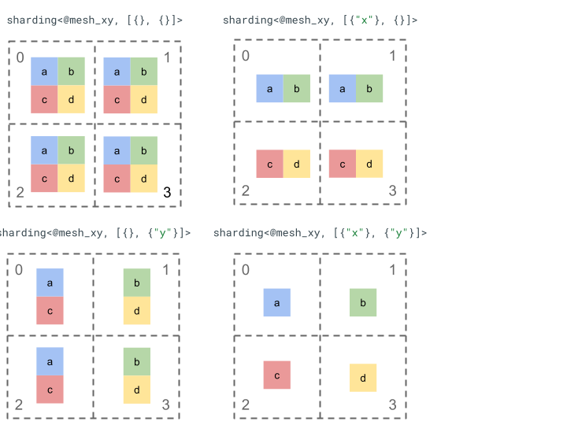

# Shardonnay RFC


## Overview

The [GSPMD](https://arxiv.org/abs/2105.04663) and [PartIR](https://arxiv.org/abs/2401.11202) teams have joined forces to build a new partitioning system called Shardonnay, which incorporates the best of both systems, and the shared experience of both teams and users.

### Benefits

* More control and predictability for users by combining GSPMD's propagation with PartIR's incremental partitioning.
* New features driven by shared experience, e.g. novel support for reshapes which notoriously generate extra communication unless users know how to work around them.
* Better usability and debuggability to increase end-user velocity, e.g. by using an axis-based sharding representation.
* A simple, open source codebase using MLIR, with a broader set of active contributors (internal, external, and across various time zones) to support users.

### Components

* Sharding Representation: An axis-based sharding representation that is bound to a specific logical mesh (out of potentially multiple meshes), and supports constraining dimension shardings and axes, splitting axes for operations like reshape, priorities for incremental partitioning, and more.
* Compiler APIs: A set of compiler components that can be used alongside the sharding representation to influence sharding propagation.
    * Input/output shardings - attach a sharding to an input or output of the main function, to indicate that this is how the input/output tensor should be sharded when given-to/returned-from the function.
    * Sharding Constraint - attach a sharding to an intermediate tensor (e.g. the result of a matmul) to indicate that this is how that tensor, or a subset of its uses, should be sharded.
    * Shard As/Like - group multiple tensors by an ID to indicate that they should be sharded in the same way.
    * Manual Computation - Encloses a sub-computation that is manually partitioned using a subset of mesh axes, where the shardings along those manual axes are specified for all inputs and outputs, and inside the sub-computation the tensor types are local w.r.t those shardings.
* Sharding Propagation: A propagation algorithm which combines user priorities and sharding constraints, with compiler cost-models and heuristics:
    * User defined priorities, e.g. do batch parallelism then ZeRO
    * Op-based priorities, e.g. element-wise ops first then matmuls, etc.
    * More fine grained heuristics, e.g. prefer batch dimensions.
* SPMD Partitioner: A component which lowers sharding propagation decisions by partitioning the program into a SPMD program, adding the necessary data movement/formating and collective operations in the process.
    * Short term, the initial implementation will use the current GSPMD SPMD partitioner.
    * Long term, we plan to create a new MLIR-based SPMD partitioner.

### Status

Shardonnay is being developed as an MLIR-based partitioning system, and will be completely open sourced. The Shardonnay project is in active development, but we seek feedback from the open source community.


## Sharding Representation

### Background

The purpose of the sharding representation is to specify how a tensor is sharded with respect to a set of available devices.

Sharding representation can either be:

*   Manually specified by the user as sharding constraints on inputs, outputs, or intermediates.
*   Transformed per operation in the process of sharding propagation.


### Objective

Design a new **axis-based** sharding representation that is general enough to handle all existing use cases of both GSPMD and PartIR.

See  for more information on the requirements.


### Overview


#### Basic structure

A logical mesh is a multi-dimensional view of devices, defined by a list of axis names and sizes.

The proposed sharding representation is bound to a specific logical mesh by its name, and can only reference axis names from that mesh. The sharding of a tensor specifies along which axes (of a specific logical mesh), each dimension of the tensor is sharded, ordered from major to minor. The tensor is replicated along all other axes of the mesh.

Let’s explore the sharding representation with a simple rank 2 tensor and 4 devices.

We first reshape the 4 devices `[0, 1, 2, 3] `into a 2-d array `[[0, 1], [2, 3]]` to create a mesh with 2 axes:

```c++
@mesh_xy = <"x"=2, "y"=2>
```

We can then shard the following rank 2 tensor `[[a, b], [c, d]]` as follows:



#### Other key components

* **Open/Closed dimensions** - dimensions can either be open - can be further sharded on available axes; or closed - are fixed and can’t be changed.
* **Explicitly replicated axes** - all axes that are not used to shard a dimension are implicitly replicated, but the sharding can specify axes that are explicitly replicated and therefore cannot be used to shard a dimension later on.
* **Axis splitting and sub-axes** - a (full) mesh axis can be split into multiple sub-axes that can be individually used to shard a dimension or be explicitly replicated.
* **Multiple logical meshes** - different shardings can be bound to different logical meshes, which can have different axes or even a different order of logical device ids.
* **Priorities** - to partition a program incrementally, priorities can be attached to dimension shardings, which determine in which order per-dimension sharding constraints will be propagated throughout the module.
* **Dimension sharding divisibility** - a dimension can be sharded on axes whose product of sizes doesn’t divide the dimension size.


## Detailed Design

We expand the basic structure and each key component in this section.


### Basic structure

The dimension shardings tell us for each dimension of the tensor, along which axes (or"sub-axes") it is sharded from major to minor. All other axes that don’t shard a dimension are implicitly replicated (or explicitly replicated)

We will start with a simple example and extend it as we describe additional features.

```c++
@mesh_xy= <"x"=2, "y"=4, "z"=2>

// The 1st tensor dimension is sharded along axis "x" and the 2nd tensor dimension is
// sharded along axis "z" then further along axis "y". The local shape of this tensor (i.e. the shape on a single device), would be tensor<2x1xf32>.
sharding<@mesh_xy, [{"x"}, {"z","y"}]> : tensor<4x8xf32>
```

#### Invariants

*   The number of dimension shardings must match the rank of the tensor.
*   All axis names must exist in the referenced mesh.
*   Axes or sub-axes can only appear once in the sharding representation (each one either shards a dimension or is "explicitly replicated".


### Open/closed dimensions

Each dimension of a tensor can either be open or closed.


#### Open

An open dimension is one open for propagation to further shard it along additional axes, i.e. the specified dimension sharding doesn’t have to be the final sharding of that dimension. This is similar (but not exactly the same as) to

*   GSPMD’s <code>unspecified_dims</code>
*   <code>partir.UNKNOWN</code>

If a dimension is open we add a <code>?</code> following the axes that the dimension is already sharded on (see example below).


#### Closed

A closed dimension is one that isn’t available for propagation to add further sharding to, i.e. the specified dimension sharding is the final sharding of that dimension and it can’t be changed. A common use case of this is to make all inputs/outputs of a module static, i.e. they can't be modified.

We can extend the example from above to have an open dimension and a closed dimension.


### Explicitly replicated axes

An explicit set of axes that a tensor is replicated on. While it can be determined that a tensor not sharded on an axis is implicitly replicated on it, having it explicit makes sure that propagation cannot use these axes to further shard an open dimension with those axes. With implicit replication, a tensor _can_ be further partitioned. But with explicit replication, nothing can partition the tensor along that axis.

Ordering of replicated axes has no effect on how the data of a tensor is stored. But, for consistency only, the axes will be stored in the order they are specified in the top level mesh. For example, if the mesh is:

And we want axes `"a"` and `"c"` to be explicitly replicated, the order should be:

We can extend our example from above to have an explicitly replicated axis.


### Axis splitting and sub-axes

A logical mesh of `n` axes is created by reshaping a 1-dimensional array of devices into an n-dimensional array, where each dimension forms an axis with a user-defined name.

The same process can be done in the compiler to split an axis of size `k` further into `m` sub-axes, by reshaping the mesh from `[...,k,...]` into `[...,k1,...,km,...]`.


#### Motivation

To understand the motivation behind splitting axes, we will look at the following example:

```c++
@mesh_xy= <"x"=4>

%arg0 : tensor<8xf32> {sdy.sharding=<@mesh_xy, [{"x"}]>}
%0 = reshape %arg0 : (tensor<8xf32>) -> tensor<2x4xf32>
```

We want to shard the result of the reshape in a way that would avoid communication (i.e. keep the data where it is). Since the size of `"x"` is greater than the 1st dimension of the result, we need to split the axis into two sub-axes `"x.0"` and `"x.1"` of size 2 each, and shard the 1st dimension on `"x.0"` and the 2nd dimension on `"x.1"`.

**Note**: shardings that are specified by the users can't have sub-axes and must reference full axes, as users can always change their mesh to have smaller axes.


#### Function Input/output shardings

It is possible that during propagation an input or output of the main function will become sharded along a sub-axis. This can be a problem for some frameworks, where we can’t express such shardings to give back to the user.

We have a few options for dealing with such cases:

*   Allow, and return the sharding in a different format (e.g. an ordered list of device IDs and dimension sizes, similar to HLO sharding).
*   Disallow, and all-gather sub-axes that shard the input/output.


#### Representation

In the same way that we can reference specific full axes from the mesh by their name, we can reference specific sub-axes by their size and the product of all sub-axis (of the same axis name) sizes to their left (that are major to them) .

To extract a specific sub-axis of size `k` from a full axis `"x"` of size `n`, we effectively reshape the size `n` (in the mesh) into `[m, k, n/(m*k)]` and use the 2nd dimension as the sub-axis. A sub-axis can thus be specified by two numbers, `m` and `k`, and we use the following concise notation to denote sub-axes: `"x":(m)k`.

*   `m>=1` is the **_pre-size_** of this sub-axis (`m` should be a divisor of `n`). The pre-size is the product of all sub-axis sizes to the left of (that are major to) this sub-axis (if equal to 1 it means there are none, If larger than 1 it corresponds to a single or multiple sub-axes).
*   `k>1` is the **_actual size_** of this sub-axis (`k` should be a divisor of `n`).
*   `n/(m*k)` is the **_post-size_**. It is the product of all sub-axis sizes to the right of (that are minor to) this sub-axis (if equal to 1 it means there are none, If larger than 1 it corresponds to a single or multiple sub-axes).

However, the number of other sub-axes doesn’t make a difference when using a specific sub-axis `"x":(m)k`, and any other sub-axes don't need to be referenced in the tensor sharding if they don't shard a dimension or are explicitly replicated.

Going back to the example in motivation, we can shard the result as follows:

```c++
@mesh_xy= <"x"=4>

%arg0 : tensor<8xf32> {sdy.sharding=<@mesh_xy, [{"x"}]>}
%0 = reshape %arg0 {sdy.sharding_per_value=<[<@mesh_xy, [{"x":(1)2}, {"x":(2)4}]>]>}
    : (tensor<8xf32>) -> tensor<2x4xf32>
```

Here is another example of a split axis where only some of its sub-axes are used.

```c++
@mesh_xy= <"x"=2, "y"=8, "z"=2>

// Axis "y" is effectively split into 3 sub-axes denoted as
//   "y":(1)2, "y":(2)2, "y":(4)2
// in order, but only "y":(2)2 is used, to shard the 2nd dimension. The local
// shape of this tensor (i.e. the shape on a single device), would be
// tensor<2x4xf32>.
sharding<@mesh_xy, [{"x"}, {"y":(2)2}]> : tensor<4x8xf32>
```

Similarly, the following two shardings are semantically equivalent. We can think of `mesh_xy` as a splitting of `mesh_full`.

```c++
@mesh_full= <"devices"=8>
@mesh_xy= <"x"=4, "y"=2>

sharding<@mesh_xy, [{"x"},{ "y"}]> : tensor<4x4xf32>
sharding<@mesh_full, [{"devices":(1)4}, {"devices":(1)2}]> : tensor<4x4xf32>
```


#### Explicitly replicated sub-axes

In addition to sub-axes being used to shard dimension, they can also be marked as explicitly replicated. We allow this in the representation because sub-axes behave just like full axes, i.e. when you shard a dimension along a sub-axis of axis `"x"`, the other sub-axes of `"x"` are implicitly replicated, and therefore can be explicitly replicated to indicate that a sub-axis must stay replicated and can’t be used to shard a dimension.

For example:

```c++
@mesh_xy= <"x"=2, "y"=8, "z"=2>

// Sub-axis "y":(1)2 is explicitly replicated and "y":(4)2 is implicitly replicated.
sharding<@mesh_xy, [{"x"}, {"y":(2)2}], replicated={"y":(1)2}> : tensor<4x8xf32>
```

Replicated sub-axis of the same full axis should be ordered in increasing order by their pre-size, for example:

```c++
replicated={"y":(4)2, "x", "y":(1)2} ~> replicated={"x", "y":(1)2, "y":(4)2}
```

#### Invariants

*   Sub-axes referenced in a tensor sharding must not overlap, e.g. `"x":(1)4` and `"x":(2)4` overlap.
*   Sub-axes referenced in a tensor sharding must be as big as possible, i.e. If a dimension sharding has two adjacent sub-axes A and B in order, or sub-axes A and B are explicitly replicated, they must not be consecutive, e.g. `"x":(1)2` and `"x":(2)4` as they can be replaced with a single `"x":(1)8`.


### Multiple logical meshes

One logical mesh is a multi-dimensional view of devices. We may need multiple views of the devices to represent our shardings, especially for arbitrary device assignments.

For example, the sharding representation in some frameworks can be an ordered list of devices and dimension sizes, but this can't be represented with the [axis splitting](?tab=t.0#heading=h.a7ox3x4zr5br) above.

We propose to overcome this limitation and handle existing corner cases by defining **multiple logical meshes** at the top level of the program. Each mesh can have a different number of axes with different names, as well as its own arbitrary assignment for the same set of devices, i.e. each mesh refers to the same set of devices (by their unique logical ID) but with an arbitrary order, similar to the GSPMD representation.

Each sharding representation is linked to a specific logical mesh, therefore it will only reference axes from that mesh.

A tensor that is assigned to one logical mesh can be used by an op that is assigned to a different mesh, by naively resharding the tensor to match the destination mesh. In GSPMD this is what is usually done to resolve conflicting meshes.

We provide two examples below:

Users can specify multiple meshes with different named axes, that have the same order of devices. In this example, `<@mesh_0, "b">` is identical to `<@mesh_1, "z">.`

Alternatively, users can specify shardings with an arbitrary order of devices and no axes names, in which case the meshes will have a different order of logical device IDs and default axis names.

**Note**: we do not plan to propagate sharding across meshes. If we were to propagate across meshes in the future, device ordering would need to be taken into consideration. The corresponding reshards may be introduced if necessary.


### Priorities

Priority is a way to prioritize certain partitioning and propagation decisions over others, and allows for incremental partitioning of a program. This is inspired by the [PartIR schedule](https://arxiv.org/abs/2401.11202), but there are some differences.

Priorities are values attached to some or all dimensions of a sharding representation (replicated axes don't have priorities).

For example:

```c++
@mesh_xy = <"w"=6, "x"=2, "y"=4, "z"=2>

//                                    |-> y is implicitly p0
%arg4 : sharding<@mesh_xy, [{"x"}p1, {"y"}, {"z",?}p2], replicated={}}>
```

Priorities give users more fine grained control over propagation, e.g., batch parallelism first, then megatron, and finally ZeRO sharding. This allows for strong guarantees about what's partitioned and allows for better debuggability by having more fine grained sharding strategies (can see how the program looks after just megatron in isolation).

We allow attaching a priority to each dimension sharding (0 by default), which indicates that all shardings with priority `<i` will be propagated to the entire program before shardings with priority `i`.

Even if a sharding has an open dimension with lower priority, e.g., `{"z",?}p2`, it won't be overridden by another tensor sharding with a higher priority during propagation. However, such an open dimension can be further sharded after all higher priority shardings have been propagated.

In other words, priorities are **NOT** about which dimension sharding is more important than another - it’s the order in which distinct groups of dimension shardings should propagate to the entire program, and how conflicts on intermediate, unannotated tensors should be resolved.


#### Invariants

*   Priorities start at 0 (highest priority) and increase (to allow users to add and remove priorities easily, we allow gaps between priorities, e.g., p0 and p2 are used but p1 isn't).
*   An empty closed dimension sharding (i.e., `{}`), shouldn't have a priority, as this won't have any effect.


### Dimension sharding divisibility

It's possible for a dimension of size `d` to be sharded along axes whose product of sizes is `n`, such that `d` is not divisible by `n` (which in practice would require the dimension to be padded).

For example:

```c++
@mesh_xy= <"x"=8, "y"=2, "z"=3>

sharding<@mesh_xy, [{"x"}, {"y"}, {"z"}]> : tensor<7x3x8xf32>
```

However, the following is still required - If the product of axis sizes that shard a dimension is greater than the dimension size, then the product of sizes without the minor-most axis must be less than the dimension size, otherwise an axis is further sharding a dimension with an un-sharded size of 1.

For example:

```c++
@mesh_xy= <"x"=2, "y"=4, "z"=2>

// Both dimension shardings here are invalid because the dimension is already fully
// sharded without the minor-most (rightmost) axis.
sharding<@mesh_xy, [{"x"}, {"y","z"}]> : tensor<1x4xf32>
```

